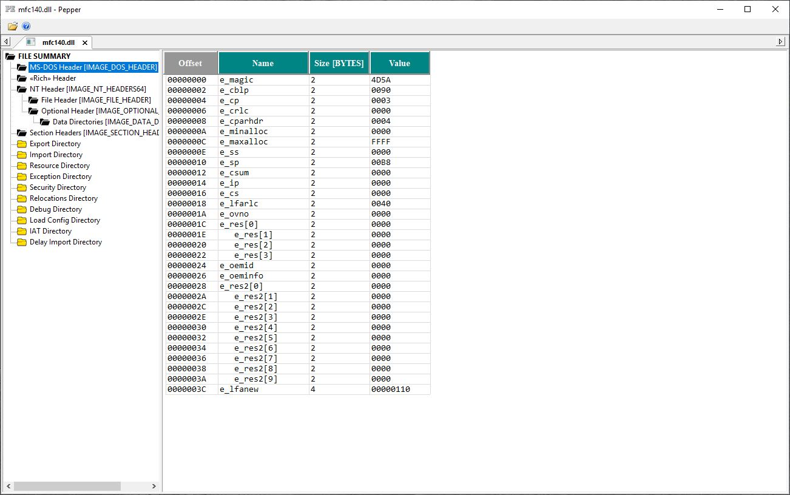
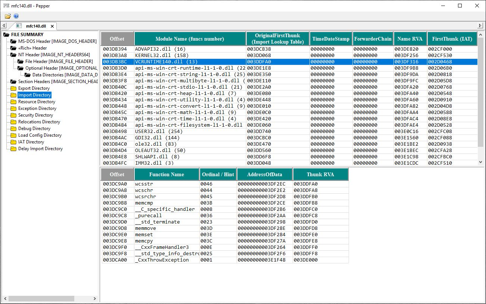
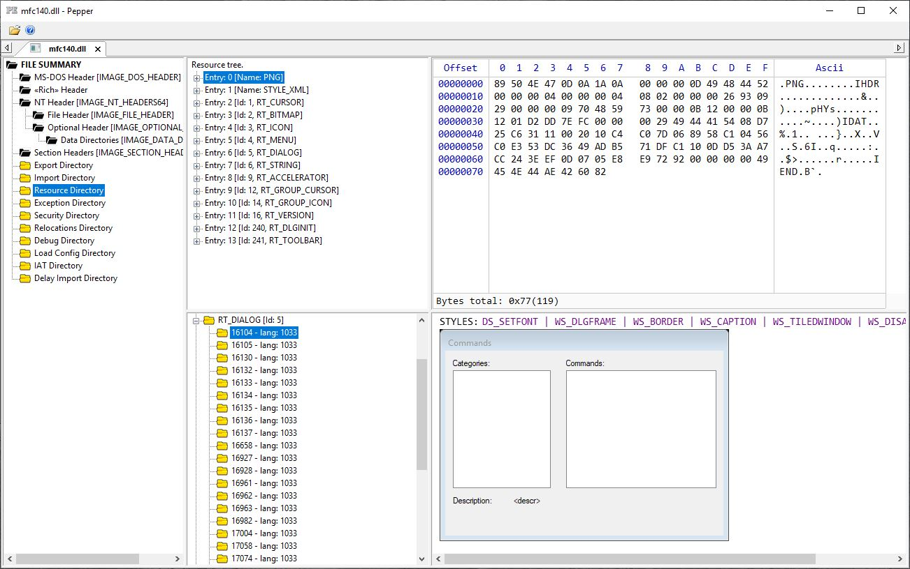

## **Pepper** 
#### PE (x86) and PE+ (x64) files viewer, based on libpe.
* All inner pe file's layouts viewer.
* Resource viewer.  

#### Built with Microsoft Visual Studio 2017, C++17, MFC.  

## **License**
This software is available under the "MIT License modified with The Commons Clause". 

### [Latest release page](https://github.com/jovibor/Pepper/releases/latest)
